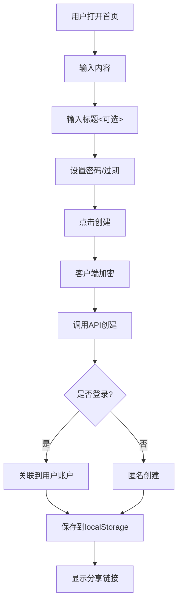
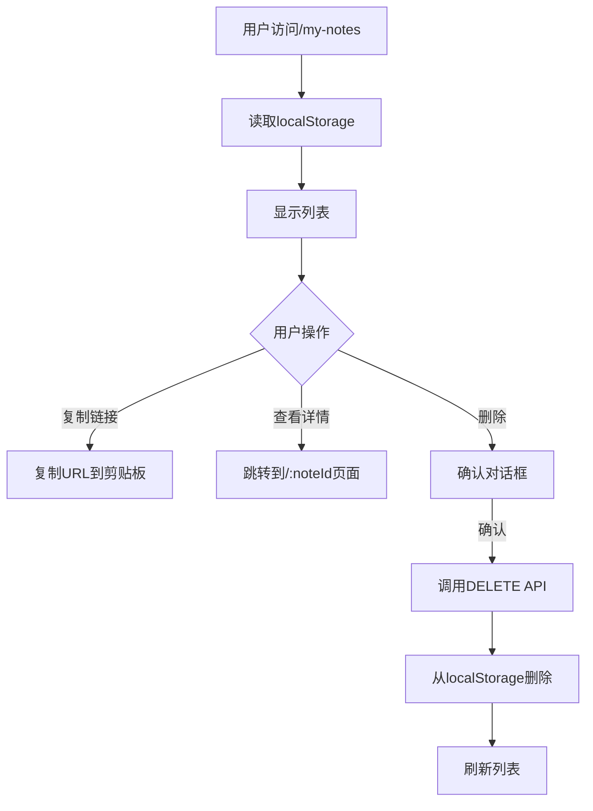

# Enclosed 改造方案 - 需求分析

## 一、用户故事

### 1.1 核心用户故事

**作为一个用户,我希望:**

1. **查看我的分享历史**
   - 我可以看到我创建过的所有notes列表
   - 列表显示: 标题、创建时间、过期时间、访问次数(如果可能)
   - 我可以快速复制分享链接

2. **管理我的分享**
   - 我可以删除不再需要的notes
   - 我可以为note添加备注/标题(方便识别)
   - 我可以看到note的状态(已过期/已被查看/等待查看)

3. **保持隐私**
   - 即使有管理功能,我的内容依然端到端加密
   - 服务器管理员仍然看不到我的note内容
   - 我可以选择匿名创建note(不关联账户)

---

## 二、功能需求

### 2.1 P0需求(必须实现)

#### F1: 我的分享列表页面

**路由**: `/my-notes`

**功能**:
- 显示所有我创建的notes
- 每条记录显示:
  - 标题(如果有)或"未命名分享"
  - 创建时间
  - 过期时间(如果设置了)
  - 状态标签(进行中/已过期/阅后即焚已销毁)
- 支持点击跳转到详情页
- 支持复制分享链接
- 支持删除操作

**UI设计**:
```
┌─────────────────────────────────────────┐
│  我的分享列表                     [+新建] │
├─────────────────────────────────────────┤
│  🔒 API密钥分享                          │
│     创建: 2小时前  |  过期: 22小时后     │
│     [复制链接] [查看] [删除]             │
├─────────────────────────────────────────┤
│  📄 临时文档                             │
│     创建: 1天前  |  阅后即焚 ✓          │
│     [已销毁]                            │
├─────────────────────────────────────────┤
│  📝 会议记录                             │
│     创建: 3天前  |  已过期 ⚠️           │
│     [已过期]                            │
└─────────────────────────────────────────┘
```

#### F2: 创建note时保存到列表

**改动点**: `create-note.page.tsx`

**流程**:
1. 用户创建note
2. 生成分享链接后,同时保存到localStorage:
   ```json
   {
     "noteId": "abc123",
     "url": "http://localhost:8787/abc123#key=...",
     "title": "用户输入的标题",  // 新增输入框
     "createdAt": "2025-10-17T08:00:00Z",
     "ttlInSeconds": 3600,
     "deleteAfterReading": false
   }
   ```
3. 如果用户已登录,额外调用 `POST /api/notes/:noteId/metadata` 关联到账户

#### F3: 删除note功能

**API**: `DELETE /api/notes/:noteId`

**权限验证**:
- 如果note关联了用户,验证当前用户是创建者
- 如果note未关联用户,允许任何人删除(通过noteId)

**前端流程**:
1. 用户点击"删除"按钮
2. 弹出确认对话框
3. 调用API删除服务器数据
4. 从localStorage移除记录
5. 刷新列表

---

### 2.2 P1需求(重要但非必须)

#### F4: 标题字段(客户端加密)

**问题**: 如果标题也加密,服务器如何搜索?

**方案**: 不搜索。标题只在localStorage存储明文,服务器存加密版本(用于数据备份)。

**数据流**:
```
用户输入标题 "API密钥"
    ↓
客户端加密: encrypt("API密钥", noteKey)
    ↓
服务器存储: encTitle = "加密后的乱码"
    ↓
LocalStor存储: title = "API密钥" (明文)
```

#### F5: 搜索/过滤

**实现**:
- 只在LocalS​​torage中搜索(因为服务器端是加密的)
- 支持按标题搜索
- 支持按状态过滤(进行中/已过期/已销毁)
- 支持按时间排序

#### F6: 批量操作

- 批量删除
- 批量导出链接

---

### 2.3 P2需求(nice to have)

#### F7: 统计信息

- 总共创建了多少notes
- 有多少仍然有效
- 存储使用情况(如果有配额)

#### F8: 导出/备份

- 导出notes列表为JSON
- 导入备份(用于跨设备同步localStorage)

---

## 三、非功能需求

### 3.1 性能

- 列表加载时间 < 500ms
- 删除操作响应 < 200ms
- LocalStorage容量限制: 假设最多5MB (约10000条记录)

### 3.2 兼容性

- 支持现代浏览器(Chrome, Firefox, Safari, Edge 最新2个版本)
- 移动端响应式设计
- PWA离线访问(如果可能)

### 3.3 安全性

- 所有API需要认证(如果启用了认证)
- 删除操作需要权限验证
- 防止CSRF攻击

---

## 四、用户流程图

### 4.1 创建note流程



### 4.2 查看列表流程



---

## 五、数据需求

### 5.1 LocalStorage Schema

```typescript
interface LocalNoteRecord {
  noteId: string;              // note ID
  url: string;                 // 完整的分享URL(含key)
  title?: string;              // 用户输入的标题(明文)
  createdAt: string;           // ISO 8601格式
  ttlInSeconds?: number;       // 过期时间(秒)
  deleteAfterReading: boolean; // 是否阅后即焚
  isPasswordProtected: boolean;// 是否有密码
}

// 存储在: localStorage.getItem('enclosed_my_notes')
type LocalNotesList = LocalNoteRecord[];
```

### 5.2 服务器Schema扩展

```typescript
interface DatabaseNote {
  // 原有字段
  payload: string;
  deleteAfterReading: boolean;
  expirationDate?: string;
  encryptionAlgorithm: string;
  serializationFormat: string;
  isPublic: boolean;

  // 新增字段
  createdBy?: string;          // 用户ID(可选,匿名时为null)
  createdAt: string;           // 创建时间(ISO 8601)
  encTitle?: string;           // 加密的标题(可选)
}
```

---

## 六、边界情况处理

### 6.1 LocalStorage丢失

**场景**: 用户清除浏览器数据

**影响**: notes列表丢失,但note本身仍然存在

**解决方案**:
1. 提供"重新导入"功能(如果有备份)
2. 如果开启了用户认证,可从服务器恢复列表
3. 文档中明确告知用户此限制

### 6.2 跨设备访问

**场景**: 用户在不同设备创建notes

**影响**: localStorage不同步,每个设备看到的列表不同

**解决方案**:
1. 如果开启了用户认证,服务器端维护完整列表
2. 提供"同步"按钮,从服务器拉取列表到localStorage
3. 否则,这是已知限制

### 6.3 大量notes性能

**场景**: 用户创建了10000+ notes

**影响**: 列表加载缓慢,localStorage可能满

**解决方案**:
1. 分页加载(每页50条)
2. 定期清理已过期的记录
3. 提供"归档"功能,将旧记录移到另一个key

---

## 七、验收标准

### P0功能验收

- [ ] 创建note后,可在列表中看到
- [ ] 列表显示正确的标题、时间、状态
- [ ] 可以复制分享链接
- [ ] 可以删除note(服务器+localStorage都删除)
- [ ] 删除后列表实时更新
- [ ] 已过期note显示"已过期"状态
- [ ] 阅后即焚note被查看后显示"已销毁"状态

### P1功能验收

- [ ] 可以为note添加标题
- [ ] 标题在列表中正确显示
- [ ] 可以搜索note(按标题)
- [ ] 可以过滤note(按状态)
- [ ] 可以按时间排序

---

## 八、排除范围(明确不做的)

以下功能**不在本次改造范围内**:

- ❌ 修改已创建的note内容(违背只读原则)
- ❌ 查看note被访问的详细日志(需要复杂的统计系统)
- ❌ note的评论/协作功能
- ❌ note的版本控制
- ❌ 高级搜索(全文检索、正则等)
- ❌ 移动端原生APP
- ❌ 邮件通知(note被查看时)

---

**下一步**: 阅读 [02-数据结构设计.md](./02-数据结构设计.md)
